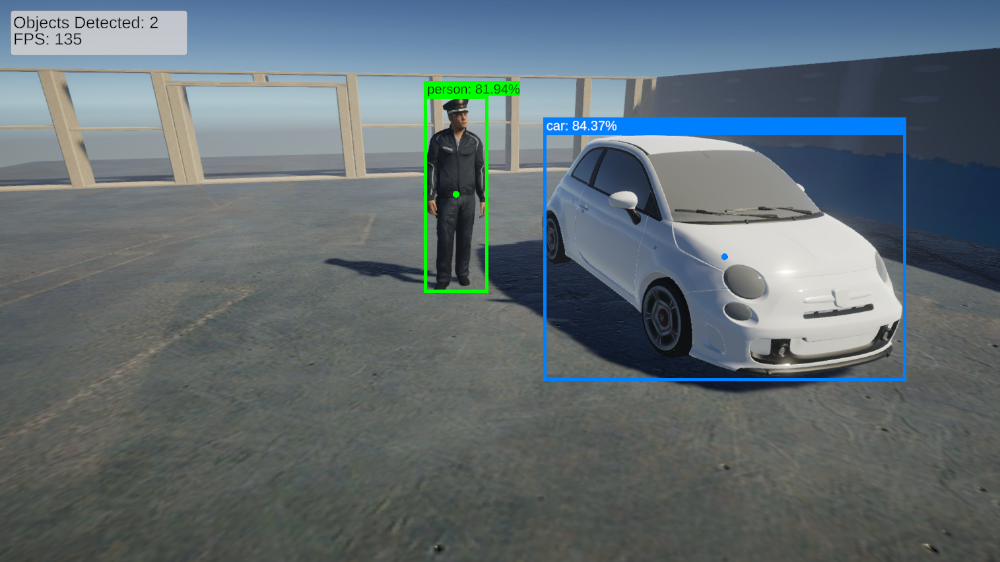

# Barracuda Inference YOLOX Demo URP
A simple Unity URP project demonstrating how to perform object detection with the barracuda-inference-yolox package using the in-game camera.

### Credits

"Fiat Abarth 500" (https://skfb.ly/oKtX7) by Luquita is licensed under Creative Commons Attribution (http://creativecommons.org/licenses/by/4.0/).

"Police" (https://skfb.ly/6UrnX) by Tech developers is licensed under Creative Commons Attribution (http://creativecommons.org/licenses/by/4.0/).
